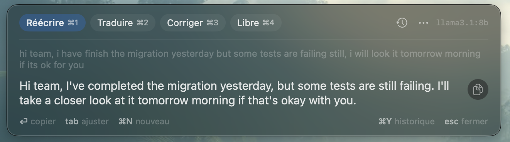
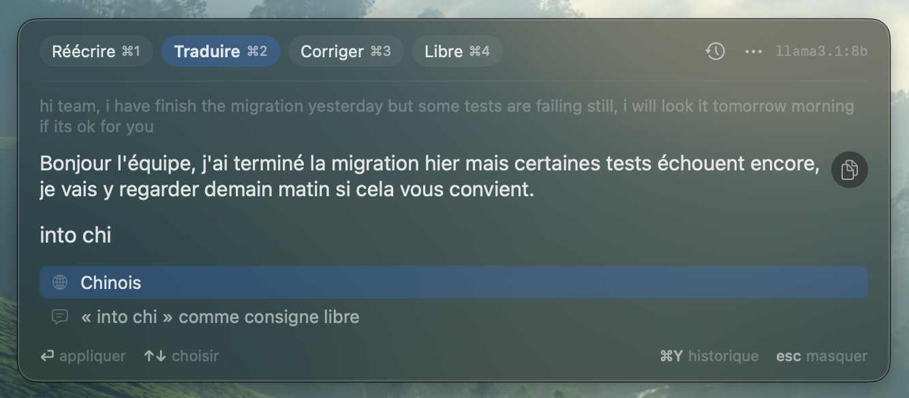
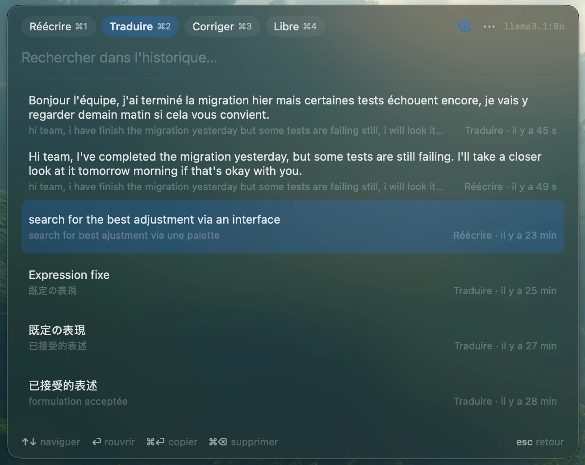

# Verto

A tiny Spotlight-style window for macOS that rewrites, translates or corrects text with a **local LLM**. Press a hotkey, paste, hit ⏎, copy.



- **Rewrite** (default): turns clumsy text — typically non-native English — into well-phrased text, **in the same language**, adding and removing nothing.
- **Translate**: detects the language (French → English, anything else → French by default), with any other target one keystroke away.
- **Adjust**, like Copilot's *Adjust* in Microsoft Teams: more professional, casual, confident, enthusiastic, shorter, longer, or any instruction you type.
- **Compare without regenerating**: every result is kept as a version; switch between them with ← →.
- **Markdown rendering** of results (headings, lists, quotes, tables, inline styles) with **syntax-highlighted code blocks** for ~20 languages.
- History, menu bar app (no Dock icon), keyboard-first, no dependencies.

> The interface is currently in French.

## Requirements

- macOS 14 or later (developed and tested on Apple Silicon only).
- Swift 5.10+ — the Xcode Command Line Tools are enough: `xcode-select --install`.
- An OpenAI-compatible LLM server, for example:
  - [Ollama](https://ollama.com): `ollama serve`, then e.g. `ollama pull llama3.1` (default endpoint `http://localhost:11434/v1`)
  - [LM Studio](https://lmstudio.ai) (`http://localhost:1234/v1`), llama.cpp server…

An 8B model such as `llama3.1` works; a larger one (e.g. `qwen2.5:14b`, `mistral-small`) gives noticeably better English.

## Install

```sh
git clone https://github.com/ghigt/verto.git
cd verto
./build.sh && open Verto.app
```

`build.sh` compiles with `swiftc` directly (no SwiftPM needed, no admin rights) and assembles `Verto.app`. You can move it to `/Applications`, and add it under *System Settings → General → Login Items* to start it at login. Alternatively, `swift run -c release` runs it without building the app bundle.

Pre-built binaries are not provided: the app isn't signed or notarized, so macOS would block a downloaded copy. Building from source avoids that.

## Usage

Press **⌥Space**, paste or type your text, press **⏎**. Then:

| Key | Action |
|---|---|
| `⏎` | copy the result (also `⌘⏎` / `⌘C`); the window stays open |
| `tab` | open the adjust palette: type "pro", "court", "esp", "chin"…, pick with `↑↓`, apply with `⏎`; with no match, `⏎` sends what you typed as a free-form instruction. `✓` = already generated (shown instantly) |
| `⌥1`…`⌥9` | apply an adjustment preset directly |
| `←` `→` | switch between generated versions |
| `⌘1`…`⌘9` | choose the action (Rewrite, Translate, Correct, Free); re-runs on the original text |
| `⌘.` | stop generation |
| `⌘N` | new conversation |
| `⌘Y` | history: search, `↑↓`, `⏎` reopen, `⌘⏎` copy, `⌘⌫` delete |
| `⌘,` or `⋯` | app menu: settings, reload config, show/hide menu bar icon, quit |
| `esc` | close (the conversation is kept until `⌘N`) |

**Translate, then pick another language in the adjust palette (`tab`):**



**History (`⌘Y`):**



The menu bar icon can be hidden from its menu. To bring it back: `⌘,` in the window → *Afficher l'icône…*, or simply open `Verto.app` again.

> On a French keyboard, `⌥Space` types a non-breaking space; change `hotkey` if you use it.

## Configuration

Open the menu (`⌘,` or the menu bar icon) → *Réglages…* to edit everything in a window: server, model (with a list fetched from the server), temperature, hotkey, history, and the actions and adjustment presets (add, remove, reorder, edit prompts). *Enregistrer* (`⌘S`) saves and applies immediately.

The settings are stored in `~/.config/verto/config.json`, created on first launch. You can also edit it by hand (*Ouvrir config.json* in the settings window), then use *Recharger la config* in the menu.

| Key | Description |
|---|---|
| `baseURL` | OpenAI-compatible endpoint (default: Ollama, `http://localhost:11434/v1`) |
| `model` | model name; empty = first model listed by the server |
| `apiKey` | sent as a Bearer token if set |
| `temperature` | default `0.1` (higher = more varied, less faithful) |
| `hotkey` | e.g. `option+space`, `ctrl+option+t`, `cmd+shift+space` |
| `prefillFromClipboard` | prefill the input with the clipboard |
| `historyLimit` | conversations kept (default `200`, `0` = disabled) |
| `actions` | list of `{ "name", "prompt" }`; an empty prompt means your text is the prompt ("Libre"). Optional `languages` (e.g. `["fr", "en"]`) enables automatic translation direction, with `{target}` replaced in the prompt; optional `targets` lists the languages suggested first in the palette |
| `adjustments` | adjustment presets `{ "name", "prompt" }` |

The text is sent between `<text>` tags so the model rewrites a question instead of answering it.

## Privacy

- Your text is sent **only** to the server configured in `baseURL`. With a local server, nothing leaves your Mac; if you point it to a cloud API, your text goes there.
- The history (`~/.config/verto/history.json`) and the `apiKey` (in `config.json`) are stored **in plain text** on your Mac. Set `historyLimit` to `0` to disable history.
- No telemetry, no network access other than the LLM endpoint.

## License

[MIT](LICENSE)
